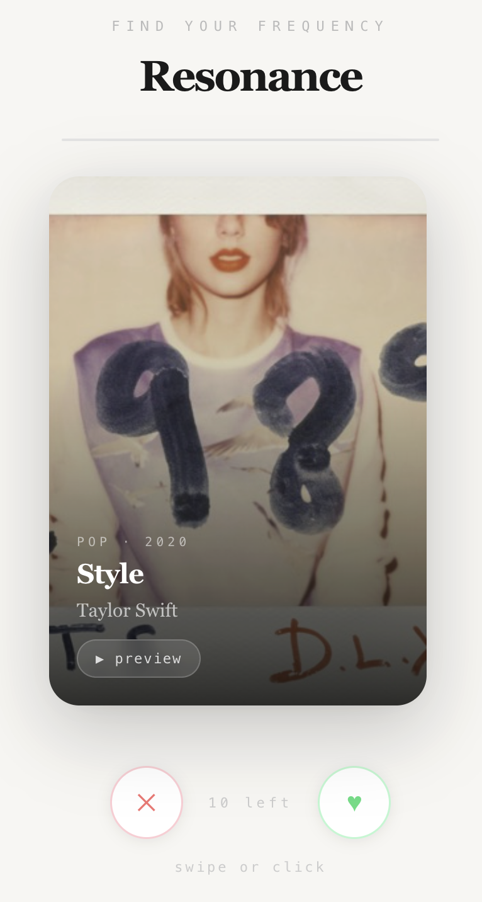

# Resonance 🎵

> *Find your frequency.*

Resonance est une app de découverte musicale basée sur le swipe. Like ou passe des titres, et Resonance génère une playlist personnalisée selon tes goûts.

## Aperçu



---

## Fonctionnalités

- 🎴 **Swipe** sur des titres (drag ou boutons)
- 🖼️ **Pochettes d'album** récupérées via l'API iTunes
- 🎯 **Recommandations** basées sur les genres et artistes likés
- 🔄 **3 rounds** si tu ne likes rien — nouveaux titres à chaque fois
- 🎧 **Ouverture Spotify** directe pour chaque recommandation
- 🗃️ **Base musicale curatée** — 100+ titres soigneusement choisis (jazz, techno, afrobeat, hip-hop, classique, indie, house...)

---

## Stack

- [Next.js 15](https://nextjs.org/) — framework fullstack React
- TypeScript
- iTunes Search API — pochettes d'album (gratuit, sans clé)
- Last.fm API — optionnel, non utilisé en prod

---

## Structure du projet

```
resonance/
├── app/
│   ├── page.tsx                  # Point d'entrée
│   └── api/
│       ├── artwork/
│       │   └── route.ts          # Proxy iTunes API (pochettes)
│       └── tracks/
│           └── route.ts          # Sélection aléatoire de titres
├── components/
│   └── SwipeCard.tsx             # Composant principal (swipe + résultats)
├── lib/
│   └── musicDatabase.ts          # Base de données musicale curatée
└── .env.local                    # Variables d'environnement (non versionné)
```

---

## Lancer le projet

```bash
npm install
npm run dev
```

Ouvre [http://localhost:3000](http://localhost:3000)

---

## Prochaines étapes

- [ ] Connexion Spotify OAuth
- [ ] Création automatique de playlist dans Spotify
- [ ] Filtrage par genre au démarrage
- [ ] Mode mobile / touch events
